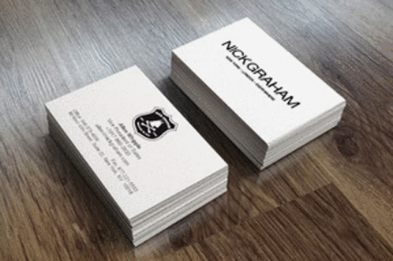

# Era Of Cards 🃏

Welcome to the Era Of Cards project repository! This is a business website aimed at providing E-visiting cards to companies of all sizes. It's a powerful tool for advertising products and businesses effectively. With various options available through paid plans, users can enhance their visiting cards, making them more informative and visually appealing. Built using the Django Framework, Era Of Cards is designed to revolutionize how companies present themselves.

## Features 🌟

- **E-Visiting Cards:** Create and customize electronic visiting cards for businesses of all scales.
- **Paid Plans:** Unlock advanced features and design elements by subscribing to different paid plans.
- **Product Showcase:** Showcase your products and services in a visually appealing manner.
- **User Dashboard:** Manage your cards, plans, and settings through an intuitive dashboard.
- **Responsive Design:** Enjoy a seamless experience across devices with our responsive design.

## Tech Stack 💻

- **Framework:** Django 🐍
- **Database:** PostgreSQL 🐘
- **Frontend:** HTML, CSS, JavaScript 🌐
- **Hosting:** Heroku ☁️

## Getting Started 🚀

To run the project locally, follow these steps:

1. Clone the repository: `git clone https://github.com/yourusername/Era-Of-Cards.git`
2. Navigate to the project directory: `cd Era-Of-Cards`
3. Install dependencies: `pip install -r requirements.txt`
4. Set up the database: `python manage.py migrate`
5. Run the development server: `python manage.py runserver`

Your app will be accessible at `http://localhost:8000/`. Start building and exploring!

## Contributing 🤝

We welcome contributions from the community. To contribute to Era Of Cards, follow these steps:

1. Fork the repository.
2. Create a new branch for your feature: `git checkout -b feature-name`
3. Make your changes and commit them: `git commit -m "Add your message here"`
4. Push to your branch: `git push origin feature-name`
5. Submit a pull request to the `main` branch.

Let's build together! 🚀

## Contact 📧

For any inquiries or feedback, feel free to reach out:

- Email: harshsurela8@gmail.com
- LinkedIn: Harsh Surela (https://www.linkedin.com/in/harsh-surela-2b73aa21a/)

## License 📝

This project is licensed under the [MIT License](link_to_license_file).

---

Thank you for considering Era Of Cards. Join us in shaping the future of business cards! 🃏🌐
